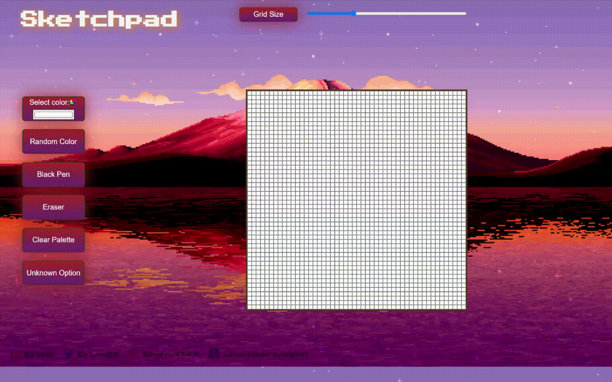
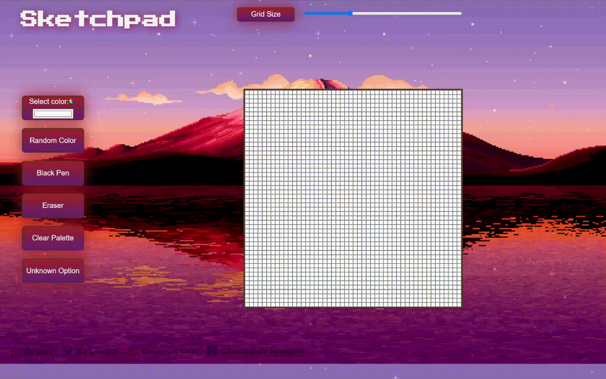

# Sketchpad

[Open the sketchpad !](https://wblachut.github.io/Sketchpad_TheOdinProject/)!

##
## PROJECT: ETCH-A-SKETCH

## Description

Web sketchpad. To make your art hover over the canvas grid in the middle. You can change color of filling tool by pressing `select color` button. You can also get `random color`, `black pen` or white color `eraser`. To clear palette press `Clear Palette`. To change grid press grid size or change range slider. Project was a part of The Odin Project Web Development learning curriculum.

## Concepts used and learned:

* DOM manipulation
* Event Listeners
* CSS styling

## Tools:

* Visual Studio Code
* Javascript
* CSS3
* HTML5

## Some ideas to apply in future:

* make range slider color sensitive
* make arts possible to save and download
* add some crazy canvas options 
